# QA-Core

**Autonomous Playwright test generation, powered by Claude.**

QA-Core is an AI agent that opens a real browser, explores your app, reviews its own work, and writes a Playwright test suite. Every test runs and passes once inside the agent before it is saved to disk, so you get specs that already work on day one.

Built on [Claude](https://www.anthropic.com/) by Anthropic. Distributed through [OpenClaw](https://openclaw.dev). Drives [Playwright](https://playwright.dev/).

## Table of contents

1. [What it does](#what-it-does)
2. [Why this is different](#why-this-is-different)
3. [How it works](#how-it-works)
4. [Quick start](#quick-start)
5. [Commands](#commands)
6. [Web UI](#web-ui)
7. [MCP server](#mcp-server-for-claude-desktop-cursor-cline-continue)
8. [Model routing and budgets](#model-routing-and-budgets)
9. [Evaluation results](#evaluation-results)
10. [Project layout](#project-layout)
11. [Configuration files](#configuration-files)
12. [Requirements](#requirements)
13. [About the author](#about-the-author)
14. [License](#license)

## What it does

QA-Core exposes three commands. Each one solves a different problem in test automation.

| Command | What you give it | What you get back |
| ------- | ---------------- | ----------------- |
| `npm run explore` | A live URL | A full Playwright suite written from a verified browser session, with a Page Object Model framework |
| `npm run generate` | A user story or Jira ticket | A Playwright spec built from acceptance criteria. You can run it to verify |
| `npm run heal` | A spec that broke because the page changed | The same spec with its broken selectors re-resolved on the live page, written back in place |

Generated files land under `output/<run-id>/`.

## Why this is different

Most "AI test generators" take a single DOM snapshot, hand it to an LLM, and hope the output works. QA-Core does not do that.

It runs a real five-stage agent pipeline. Three stages use the LLM. Two don't.

* The **Planner** uses Haiku to read one page snapshot and write a numbered scenario list.
* The **Explorer** uses Opus and a tool-use loop to drive the browser. It navigates, clicks, fills, and asserts against the live page. Every action is verified before the next one. Cookies and storage are cleared between scenarios so tests do not inherit state from each other.
* The **Critic** uses Sonnet to review the trace and label each scenario as ship, weak, or fix.
* The **Reality-Check Replay** re-executes every recorded scenario in a fresh browser context. Scenarios that fail the second independent run are dropped before any spec is written. Zero LLM cost.
* The **Stability Iteration** runs each replay-survivor three more times. Scenarios that pass-then-fail are dropped as flaky. Produces a `flake_rate` metric per run. Zero LLM cost.
* The **Transcriber** is deterministic. It turns the verified trace into Playwright code with a matching `beforeEach` so the emitted spec runs under the same isolation policy.
* The **Healer** is on-demand. When a real Playwright run fails because the page changed, it re-resolves the broken selectors live.

This means every line in the final spec corresponds to an action that already passed five independent executions in fresh browser contexts before the file is written: one exploration, one replay, three stability re-runs.

## How it works

```text
                         ┌── per-host memory ──┐
                         │  (loaded as cached  │
                         │   system block)     │
                         └──────────┬──────────┘
                                    │
[1] Planner   (Haiku)  ─────────────┘
    1 page snapshot then numbered scenario list

[2] Explorer  (Opus)  ◀─ tool-use loop with prompt caching
    navigate / click / fill / assert / get_dom / finish
    cookies + storage cleared between scenarios
    every action verified against the live page

[3] Critic    (Sonnet)
    reads the trace, returns ship / weak / fix verdicts

[4] Reality-Check Replay      (zero LLM cost)
    re-executes each scenario in a fresh browser context
    drops anything that fails the independent re-run

[5] Stability Iteration       (zero LLM cost)
    runs each replay-survivor 3 more times
    drops anything that pass-then-fails; reports flake_rate

       ↓

  trace transcriber then output/<run-id>/<name>.spec.ts
                       then run-report.json (plan, verdicts, cost, cascade,
                                             replay, stability)
```



```mermaid
flowchart LR
    classDef stage fill:#1a1a22,stroke:#b9a6ff,color:#f5f5f7
    classDef verify fill:#1a1f1a,stroke:#5dd5a4,color:#5dd5a4
    classDef optional fill:#131318,stroke:#f4c560,stroke-dasharray:5 5,color:#f4c560
    classDef io fill:#0d0d10,stroke:#5b5b66,color:#9d9da7
    classDef memory fill:#0d0d10,stroke:#5dd5a4,color:#5dd5a4

    URL["URL or Story"]:::io
    P["Planner (Haiku 4.5)"]:::stage
    REV["Review checkpoint"]:::optional
    E["Explorer (Opus 4.7) tool-use loop"]:::stage
    C["Critic (Sonnet 4.6) ship, weak, fix"]:::stage
    R["Reality-Check Replay (zero LLM)"]:::verify
    S["Stability Iteration 3x (zero LLM)"]:::verify
    T["Transcriber + axe-core"]:::stage
    H["Healer (deterministic) on-demand"]:::stage
    SPEC["Spec file (.ts or .js)"]:::io
    CI["CI and GitHub Actions"]:::io
    MEM["Per-host memory"]:::memory

    URL --> P
    P -.->|optional| REV
    REV -.->|from plan| E
    P --> E
    E --> C
    C --> R
    R --> S
    S --> T
    T --> SPEC
    SPEC --> CI
    SPEC -.->|on failure| H
    H -.->|patched| SPEC

    MEM -.->|cached prompt| P
    MEM -.->|cached prompt| E
    E -.->|observed intents| MEM
```

### The selector cascade

QA-Core picks selectors in this order: `getByRole`, then `getByLabel`, then `getByTestId`, then CSS as a last resort. A level only "wins" when it resolves to exactly one element. When a role / label match resolves to multiple elements, the cascade records an `ambiguous` flag and the transcriber emits `.first()` honestly — no silent strict-mode violations in CI. The level that resolved each call is logged and the Critic can flag overuse of CSS.

### Auto-injected accessibility checks

Every generated spec ships with an `@axe-core/playwright` accessibility check against the landing page. The check fails only on `critical` and `serious` WCAG 2 AA violations and logs the rest. This was a deliberate change in v2 — a zero-tolerance gate is unshippable because real marketing pages routinely have low-severity color-contrast nits that swamp the signal.

### Per-host memory

After each run, the agent saves what it learned about that site to `.qa-core/sites/<host>.json`. This includes the intents it observed and the selector cascade level that worked. The next run against the same host loads this memory into the system prompt as a cached block. Repeat runs are typically 90 percent cheaper than the cold path.

### Self-healing

Healing happens in two places, both deterministic and both reusing the same selector ladder.

During exploration, a selector that fails to resolve is re-resolved automatically. The agent drops the specific hint that failed and re-finds the element by its semantic intent, then continues. Each heal is logged (`healed: <old> re-resolved to <new>`) and recorded in the run report. This is scoped to locators only. An assertion that fails is never healed, because that may be a real bug. After two failed heals on the same selector it is recorded as a finding, not a silent pass.

For an existing spec, `npm run heal -- <spec-path>` opens the live page the spec targets, probes every locator, and re-resolves only the broken ones with that same ladder. It reads the page object too when the spec uses POM. Each re-resolved locator is confirmed to point at the same intended element (its accessible name / text still matches) before it is accepted, so a heal to the wrong element is refused. The repaired files are written back in place and every selector it could not heal is reported. No model call, no spec run.

### More reference material

* Full reference: [`docs/DOCUMENTATION.md`](./docs/DOCUMENTATION.md). Every component, flag, env var, and file format.
* Flow diagram in SVG: [`docs/architecture.svg`](./docs/architecture.svg).
* Interactive HTML page: [`docs/architecture.html`](./docs/architecture.html).
* MCP install guide: [`docs/MCP.md`](./docs/MCP.md).

## Quick start

```bash
git clone https://github.com/sardar-usman/qa-core-agent.git
cd qa-core-agent
cp .env.example .env          # then add your ANTHROPIC_API_KEY
bash setup.sh                 # installs dependencies and Playwright Chromium
```

Required environment variable: `ANTHROPIC_API_KEY`. Get one at [console.anthropic.com](https://console.anthropic.com/settings/keys).

Optional: `QA_CORE_AUTH_URL`, `QA_CORE_AUTH_USER`, `QA_CORE_AUTH_PASS` if you want a stored auth session reused across tests. See [`tests/auth.setup.ts`](./tests/auth.setup.ts).

## Commands

### Explore a URL

```bash
npm run explore -- https://www.saucedemo.com/
npm run explore -- https://www.saucedemo.com/ --lang js      # JavaScript output
npm run explore -- https://www.saucedemo.com/ --name login   # custom filename
```

By default `/explore` emits a full Page Object Model framework. Output lands under `output/<timestamp>-<host>/`:

```text
output/20260514-160000-saucedemo-com/
  pages/
    BasePage.ts                    # base class with goto + waitReady helpers
    SaucedemoPage.ts               # typed Locator fields + loginAs(user, pass)
  tests/
    saucedemo.spec.ts              # spec that uses the page object
  a11y/
    landing.a11y.spec.ts           # auto-injected WCAG 2 AA check
  run-report.json                  # cost, cascade stats, scenario list
```

The page class looks like this:

```typescript
export class SaucedemoPage extends BasePage {
  readonly url = "https://www.saucedemo.com/";
  readonly username: Locator;
  readonly password: Locator;
  readonly loginButton: Locator;
  readonly loginError: Locator;

  constructor(page: Page) {
    super(page);
    this.username    = page.getByRole("textbox", { name: "Username" });
    this.password    = page.getByRole("textbox", { name: "Password" });
    this.loginButton = page.getByRole("button",  { name: "Login" });
    this.loginError  = page.locator("[data-test=error]");
  }

  async loginAs(username: string, password: string): Promise<void> {
    await this.username.fill(username);
    await this.password.fill(password);
    await this.loginButton.click();
  }
}
```

And the spec that uses it:

```typescript
test("[happy] logged in with valid credentials", async ({ page }) => {
  await saucedemoPage.loginAs("standard_user", "secret_sauce");
  await expect(page).toHaveURL(/inventory/);
});
```

If you prefer a single-file output without the page object, pass `--no-pom`.

### Review mode (sign-off before automation)

For team workflows where a lead needs to approve scenarios before the Explorer runs:

```bash
npm run explore -- https://www.saucedemo.com/ --review
# writes output/<run-id>/plan.csv and exits
```

Open `plan.csv` in Excel, Numbers, or Google Sheets. Set `Approve=no` on any row you want to skip. Then resume:

```bash
npm run explore -- --from-plan output/<run-id>/plan.csv
# skips Planner, runs Explorer + Critic + Transcriber on approved scenarios only
```

The Planner cost is paid only once. The CSV header preserves the target URL, so the resume command needs no extra arguments.

### Generate tests from a user story

```bash
npm run generate -- "As a user I want to log in so I can access my dashboard"
npm run generate -- "..." --lang js --base-url https://staging.example.com
```

This one does not open a browser. It produces code from acceptance criteria. Run the spec to verify it works against your real app.

### Heal a spec that broke

```bash
npm run heal -- output/<run-id>/<name>.spec.ts [--base-url https://...] [--dry-run]
```

QA-Core opens the live page the spec targets (from a `page.goto`, a page object's `url`, or `--base-url`) and probes every locator. A locator that still resolves is left untouched. A broken one is re-resolved on the live page with the same locator ladder the Explorer uses, then confirmed to point at the same intended element before it is accepted. When the spec uses POM, the locators inside the imported page object are healed too. The repaired files are written back in place, `--dry-run` previews without writing, and the report names every heal and every selector it could not heal. This is deterministic: no model call and no spec run.

### Run the suite

```bash
npx playwright test output/<run-id>/<name>.spec.ts
```

Playwright is configured with Chromium, Firefox, WebKit, and mobile projects. CI mode adds retries, trace on first retry, and an HTML report.

## Web UI

The chat-style UI at [`qa-core-ui.html`](./qa-core-ui.html) talks to a WebSocket gateway that bridges the OpenClaw web surface to the agent runtime.

```bash
npm run gateway              # starts ws://127.0.0.1:18789
open qa-core-ui.html         # in your browser
```

Click **Connect** in the header. Then type a slash command:

* `/explore https://...`
* `/generate "user story"`
* `/heal output/<run-id>/<name>.spec.ts`

The gateway streams progress messages as the Planner, Explorer, and Critic stages run. It then sends the generated spec as a final message that the UI renders as a copy and save code block. The Activity panel on the right has three tabs: Results (run history), Files (list of generated files with copy and download), and Log (live event stream). The refresh button re-syncs runs from the gateway.

Optional auth: set `QA_CORE_GATEWAY_TOKEN` in your environment. The UI accepts the token via the page URL fragment, for example `qa-core-ui.html#token=<value>`.

## MCP server (for Claude Desktop, Cursor, Cline, Continue)

QA-Core ships an MCP (Model Context Protocol) server. Any MCP-aware client can use the three workflows as first-class tools, with no gateway, no UI, and no clone-and-run setup.

```bash
npm run mcp                  # standalone, useful for debugging via MCP Inspector
```

For real use, point your AI client at the server through its config file. The full install guide is [`docs/MCP.md`](./docs/MCP.md). An example Claude Desktop config is at [`docs/claude_desktop_config.example.json`](./docs/claude_desktop_config.example.json).

Once installed, in Claude Desktop you can just chat:

> "Use qa-core to explore `https://www.saucedemo.com/` and show me the generated spec."

Claude calls the `qa_explore` MCP tool. The server runs the multi-agent pipeline and returns the verified spec.

**Tools exposed:** `qa_explore`, `qa_generate`, `qa_heal`.
**Resources exposed:** `qa-core://runs`, `qa-core://memory`.

## Model routing and budgets

Each stage of the pipeline uses a different model so cost stays low and quality stays high. You can override any of them with environment variables.

| Setting | Default | Purpose |
| ------- | ------- | ------- |
| `QA_CORE_MODEL_PLANNER` | `claude-haiku-4-5` | Cheap scenario derivation pre-pass |
| `QA_CORE_MODEL_EXPLORE` | `claude-opus-4-7` | Browser-driving tool-use loop. Use Opus for hard sites |
| `QA_CORE_MODEL_CRITIC` | `claude-sonnet-4-6` | Post-run review with per-scenario verdicts |
| `QA_CORE_MODEL_TRANSCRIBE` | `claude-sonnet-4-6` | Story to spec in `npm run generate` |
| `QA_CORE_MAX_STEPS` | `40` | Hard ceiling on tool calls per `/explore` |
| `QA_CORE_MAX_USD` | `2.00` | Hard ceiling on cost per run. The agent aborts if exceeded |

Prompt caching is enabled on three cached blocks: the frozen behavior rules, the site memory for the target host, and the planner output. Repeat runs against the same host reuse the first two. Cost is typically 90 percent lower than a cold run.

## Evaluation results

QA-Core ships an evaluation suite that runs the agent against three public test sites, executes the generated specs, and publishes pass-rate, replay pass count, flake_rate, cost, and selector cascade distribution.

```bash
npm run eval
# writes eval-results/<timestamp>/summary.md
```

### v1 → v2 — same eval harness, same budget, hardening pass shipped between

| Site | v1 (2026-05-14) | **v2 (2026-06-09)** | Delta |
| ---- | --------------: | ------------------: | ----: |
| saucedemo | 80% (4/5) | **100% (6/6)** | +20 pp |
| the-internet | 0% (0/6) | **50% (2/4)** | +50 pp |
| practice-todo | 0% (0/4) | **75% (3/4)** | +75 pp |
| **Aggregate** | **27% (4/15)** | **79% (11/14)** | **+52 pp** |
| **Cost** | **$0.7997** | **$0.7940** | flat |

v2-specific metrics that v1 had no equivalent for:

| Site | Replay pass / fail | Stable | Flaky | Broken | flake_rate |
| ---- | -----------------: | -----: | ----: | -----: | ---------: |
| saucedemo | 5 / 0 | 5 | 0 | 0 | 0.0% |
| the-internet | 4 / 1 | 3 | 1 | 0 | 25.0% |
| practice-todo | 3 / 0 | 3 | 0 | 0 | 0.0% |

In the v2 eval, the Reality-Check Replay caught and dropped 1 scenario that passed exploration but failed an independent re-run. The Stability Iteration caught and dropped 1 scenario that pass-then-failed across 3 re-runs. **v1 would have shipped both of those.** v2 caught them before write.

Full breakdown: [`docs/v2-eval-summary.md`](./docs/v2-eval-summary.md) (a stable copy of the latest eval; `eval-results/` itself is gitignored as a runtime output directory).

> **A note on absolute pass-rates.** Single-run aggregate numbers are noisy. Public test sites sometimes rate-limit, sleep (Heroku free tier), or rotate selectors. The signal worth quoting is the **v1 → v2 delta on identical sites and identical budget**, because that comparison controls for site flakiness — the same noise is in both columns. The jump from 27 percent to 79 percent at flat cost is reproducible. Any single eval run remains one data point, not the truth.

## Project layout

```text
src/
  agent/
    runtime.ts        # five-stage pipeline orchestrator + budgets
    planner.ts        # [stage 1] Haiku pre-step: scenario derivation from one DOM snapshot
    tools.ts          # [stage 2] Playwright tool surface exposed to Opus
    critic.ts         # [stage 3] Sonnet post-step: per-scenario ship/weak/fix verdicts
    replay.ts         # [stage 4] Reality-Check Replay (zero LLM): re-executes scenarios
    stability.ts      # [stage 5] Stability Iteration (zero LLM): 3x re-runs, flake_rate
    selectors.ts      # role, label, testid, CSS cascade resolver with strict-mode guard
    transcriber.ts    # inline emission (verified trace to single .spec file)
    pom.ts            # Page Object Model emitter (default): BasePage + per-page classes
    trace.ts          # types: Scenario, TraceStep, Assertion, RunReport
    generate.ts       # /generate: story to spec, no browser
    heal.ts           # selector self-healing, re-resolves broken calls live
    memory.ts         # per-host fingerprints + project memory, cached into prompt
    eval-shim.ts      # __name no-op shim installed into every browser context
    csv.ts            # CSV utilities for the --review plan-approval flow
  cli/
    explore.ts        # npm run explore
    generate.ts       # npm run generate
    heal.ts           # npm run heal
  server/
    gateway.ts        # WebSocket bridge between qa-core-ui.html and the runtime
  mcp/
    server.ts         # MCP server: exposes qa_explore, qa_generate, qa_heal
docs/
  DOCUMENTATION.md    # full reference, high-level architecture
  CODEBASE.md         # file-by-file engineering reference (this file's parent)
  architecture.html   # full-page architecture infographic
  architecture.svg    # single-image flow diagram
  MCP.md              # MCP install guide for Claude Desktop, Cursor, Cline
scripts/
  eval.ts             # npm run eval
  smoke-*.ts          # regression-protection smoke tests (seven of them)
tests/
  auth.setup.ts       # storage-state fixture for auth-gated apps
.qa-core/             # per-host memory cache (gitignored)
qa-core-ui.html       # web UI client
playwright.config.ts
.github/workflows/qa-core.yml
```

## Configuration files

The agent's behavior is defined in plain markdown so OpenClaw can load it.

| File | Purpose |
| ---- | ------- |
| [`agent/SOUL.md`](./agent/SOUL.md) | Operating principles, hard rules, defaults |
| [`agent/IDENTITY.md`](./agent/IDENTITY.md) | What QA-Core is and what it does |
| [`agent/TOOLS.md`](./agent/TOOLS.md) | Tool surface and selector cascade |
| [`agent/MEMORY.md`](./agent/MEMORY.md) | Per-project persistent context |
| [`skills/explore-url.md`](./skills/explore-url.md) | `/explore` command behavior |
| [`skills/generate-tests.md`](./skills/generate-tests.md) | `/generate` command behavior |

## Requirements

* Node.js 20 or newer
* `ANTHROPIC_API_KEY`
* Playwright Chromium (`npx playwright install chromium`)

## About the author

**Muhammad Usman**
Senior QA Automation Engineer. AI Test Engineering Lead.
ISTQB CTFL Certified. Upwork Top Rated Plus (Top 3 percent).
10+ years in QA automation.

* Website: [sardarusmanjutt.com](https://sardarusmanjutt.com)
* LinkedIn: [linkedin.com/in/sardarusmanjutt](https://linkedin.com/in/sardarusmanjutt)
* Email: [muhammad.usman101@hotmail.com](mailto:muhammad.usman101@hotmail.com)

## License

MIT. Use it, fork it, build on it.
