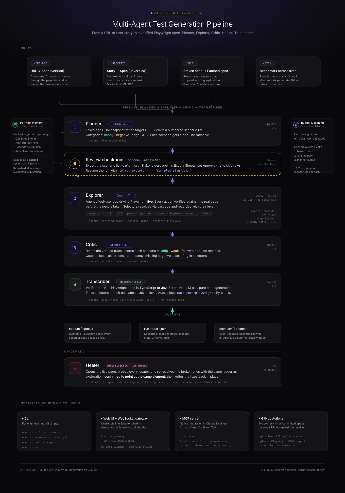

# QA-Core — Full Documentation

**Version 0.4 (v2 hardening pass)** · An autonomous QA agent that drives a real browser, reviews its own work, and generates Playwright test suites where every line passes 5 independent executions in fresh browser contexts before the file is written.



📊 [**View the interactive architecture diagram**](./architecture.html) · 🔌 [**MCP install guide**](./MCP.md)

---

## Table of contents

1. [Introduction](#1-introduction)
2. [Quick start](#2-quick-start)
3. [Architecture overview](#3-architecture-overview)
4. [The multi-agent pipeline](#4-the-multi-agent-pipeline)
5. [Core concepts](#5-core-concepts)
6. [Commands reference](#6-commands-reference)
7. [Interfaces](#7-interfaces)
8. [Configuration](#8-configuration)
9. [Output artifacts](#9-output-artifacts)
10. [Generated spec features](#10-generated-spec-features)
11. [Review workflow](#11-review-workflow)
12. [Self-healing workflow](#12-self-healing-workflow)
13. [Cost model](#13-cost-model)
14. [Memory system](#14-memory-system)
15. [Eval harness](#15-eval-harness)
16. [API reference](#16-api-reference)
17. [Troubleshooting](#17-troubleshooting)
18. [File structure](#18-file-structure)
19. [Roadmap](#19-roadmap)

---

## 1. Introduction

### What QA-Core is

QA-Core is an autonomous QA agent that turns three kinds of input into runnable Playwright test suites:

| Input | Command | Output |
|---|---|---|
| A live URL | `npm run explore -- <url>` | A Playwright spec generated from a verified browser session |
| A user story or Jira ticket | `npm run generate -- "<story>"` | A Playwright spec derived from acceptance criteria (unverified) |
| A spec that broke | `npm run heal -- <spec>` | A patched copy of the spec with re-resolved selectors |

It is built on:

- **Claude** (via the Anthropic SDK) — Opus 4.7 for exploration, Sonnet 4.6 for review and healing, Haiku 4.5 for cheap pre-passes
- **Playwright** + TypeScript — the test framework + the live browser the agent drives
- **OpenClaw** — the persona, channel routing, and slash-command layer
- **MCP** (Model Context Protocol) — for native integration in Claude Desktop, Cursor, Cline, etc.

### What makes it different

Most "AI test generators" dump the DOM into an LLM and pray. QA-Core does the opposite — it **uses Playwright as a live tool through Claude's tool-use API**, then transcribes the *verified* session into a spec. Every action in a generated test has already passed once against the real page before the file is written.

The other differentiators:

- **Five-stage pipeline** — Planner (Haiku) → Explorer (Opus) → Critic (Sonnet) → Reality-Check Replay (zero LLM) → Stability Iteration (zero LLM)
- **Reality-Check Replay** — after the LLM stages, every recorded scenario is re-executed once in a fresh browser context. Anything that fails the independent re-run is dropped before the spec is written.
- **Stability Iteration** — each replay survivor is re-run three more times. Anything that pass-then-fails is classified as flaky and dropped. Produces a `flake_rate` metric per run.
- **Strict-mode-safe selector cascade** — `getByRole` → `getByLabel` → `getByTestId` → CSS, requires `count === 1` to claim a level, marks ambiguous matches with an `ambiguous` flag, emits `.first()` honestly so the spec never silently fails strict-mode in CI.
- **Per-scenario state isolation** — cookies, localStorage, and sessionStorage are cleared at the start of every scenario. The transcribed spec emits a matching `beforeEach` so tests pass in isolation, not just in the order they were recorded.
- **Console + network error capture** — every `console.error`, `pageerror`, and 4xx/5xx response during a scenario is attached to the scenario record.
- **Per-codebase memory** — site fingerprints cached across runs, so repeat runs against the same host are faster, cheaper, and more consistent
- **Self-healing selectors** — when a spec breaks because the UI changed, the Healer re-resolves the broken calls against the live page
- **Partitioned accessibility check** — every generated spec ships with an `@axe-core/playwright` check that fails only on `critical` / `serious` WCAG 2 AA violations and logs the rest. (v1's zero-tolerance gate was unshippable in practice.)
- **Cost budgets** — hard USD ceiling per run, per-stage cost reporting, prompt caching on three blocks
- **Optional human checkpoint** — `--review` mode exports the Planner's scenario list to a CSV for stakeholder approval before the Explorer runs
- **Four interfaces** — CLI, Web UI (via WebSocket gateway), MCP server (Claude Desktop / Cursor / Cline), GitHub Actions

---

## 2. Quick start

### Prerequisites

- Node.js 20 or higher
- An Anthropic API key

### Install

```bash
git clone https://github.com/sardarusmanjutt/qa-core-agent.git
cd qa-core-agent
cp .env.example .env             # then edit .env and add ANTHROPIC_API_KEY
bash setup.sh                    # installs deps + Playwright Chromium
```

### Run your first exploration

```bash
npm run explore -- https://www.saucedemo.com/
```

You'll see the five pipeline stages print in sequence — Planner, Explorer, Critic, Reality-Check Replay, Stability Iteration — followed by the generated spec path and a cost summary. The spec is under `output/<run-id>/<name>.spec.ts`. The two non-LLM stages (Replay + Stability) drop any scenario that can't be reproduced in a fresh browser context before transcription.

### Run the generated tests

```bash
npx playwright test output/<run-id>/<name>.spec.ts
```

### Try the web UI

```bash
npm run gateway                   # terminal 1
open qa-core-ui.html              # terminal 2 (or just double-click in Finder)
```

Click **Connect** in the header, then type `/explore https://www.saucedemo.com/`.

### Try the MCP integration

See [docs/MCP.md](./MCP.md) for full instructions. Quick version: paste this into your Claude Desktop config, restart, then chat *"use qa-core to explore https://saucedemo.com"*.

```json
{
  "mcpServers": {
    "qa-core": {
      "command": "npx",
      "args": ["tsx", "/absolute/path/to/qa-core-agent/src/mcp/server.ts"],
      "env": {
        "ANTHROPIC_API_KEY": "sk-ant-...",
        "QA_CORE_PROJECT_ROOT": "/absolute/path/to/qa-core-agent"
      }
    }
  }
}
```

---

## 3. Architecture overview

QA-Core is built in three layers:

```
┌──────────────────────────────────────────────────────────────┐
│ Interface layer                                                │
│ CLI · Web UI + WebSocket gateway · MCP server · GitHub Actions│
└──────────────────────────────┬───────────────────────────────┘
                               │
┌──────────────────────────────▼───────────────────────────────┐
│ Agent runtime                                                   │
│ Planner (Haiku) → Explorer (Opus) → Critic (Sonnet) → Trans-  │
│ criber. Healer on-demand. Memory loaded as cached system block.│
└──────────────────────────────┬───────────────────────────────┘
                               │
┌──────────────────────────────▼───────────────────────────────┐
│ Tools                                                           │
│ Playwright (browser) · Anthropic SDK (LLM) · axe-core (a11y)  │
└────────────────────────────────────────────────────────────────┘
```

The full flow is documented visually in [`docs/architecture.svg`](./architecture.svg) and as an interactive page in [`docs/architecture.html`](./architecture.html).

### Why the pipeline is shaped this way

| Decision | Reason |
|---|---|
| Use tool-use, not DOM-dump generation | Generated tests have already passed once before transcription, so they actually run |
| Split into three LLM agents | Each agent uses a different model — Opus tokens are too expensive for cheap planning, Sonnet is fine for review. Separation also makes the Critic an honest reviewer of the Explorer's work. |
| **Add two zero-LLM verification stages after the agents** | The LLM-driven stages can produce scenarios that pass once and never again. Replay catches "passes-once" failures; Stability catches genuine flakes. Both are free in token cost — just wall clock. |
| Memory cached per host | Repeat runs against the same site reuse learned intents and cascade preferences. Prompt caching applies. |
| Hard cost ceiling enforced in-process | Stops a runaway run before it eats your API budget. |
| Strict-mode-safe selector cascade with level tracking | The transcriber emits the most resilient selector available; `.first()` is emitted only when the cascade actually had to take a multi-match. The Critic can flag CSS overuse. |
| Per-scenario state isolation by default | Tests that ship from the agent run in the same isolation Playwright gives each `test()` — no "passes alone, fails together" trap. |
| `paused` discriminator on the return type | Review mode is a first-class state, not a special exception path. |

---

## 4. The multi-agent pipeline

### Stage 1 — Planner (Haiku 4.5)

**File:** [`src/agent/planner.ts`](../src/agent/planner.ts)

**Job:** Open the target URL once, take a snapshot of the visible interactive elements, and emit a numbered scenario list with categories and rationales.

**Why Haiku:** Planning is cheap reasoning. Haiku is ~5× cheaper than Sonnet, ~25× cheaper than Opus, and the planning quality is already good enough.

**Input:**
- URL
- (Implicit) Per-host memory injected into the system prompt as a cached block

**Output:**
```typescript
interface PlannedScenario {
  name: string;
  category: 'happy' | 'negative' | 'edge' | 'a11y';
  rationale: string;
}
```

**Typical cost:** ~$0.001 per run · ~3s wall clock

**Override the model:** `QA_CORE_MODEL_PLANNER=claude-sonnet-4-6`

---

### Optional checkpoint — Review (human)

**Mechanism:** `--review` flag on `npm run explore`.

After the Planner runs, the scenario list is written to `output/<run-id>/plan.csv` and the run exits cleanly with resume instructions. A stakeholder opens the CSV in Excel / Numbers / Sheets, sets `Approve=no` on any row to skip, then resumes:

```bash
npm run explore -- --from-plan output/<run-id>/plan.csv
```

The Explorer runs only on the approved scenarios. Planner cost is paid once; the resume does not re-run the Planner.

See [section 11](#11-review-workflow) for details.

---

### Stage 2 — Explorer (Opus 4.7)

**File:** [`src/agent/runtime.ts`](../src/agent/runtime.ts) (the `runAgentLoop` function)

**Job:** Drive a real Chromium browser through the target URL via Claude's tool-use API. Cover each planned scenario by executing it live and recording every action.

**Why Opus:** Exploration is the hard problem — the agent has to reason about page state, choose the right selector hint, recover from failed actions, decide when a scenario is "done." Opus's tool-use is best-in-class.

**Tools exposed to the model:** `navigate` · `click` · `fill` · `press` · `get_dom` · `assert` · `begin_scenario` · `end_scenario` · `wait` · `finish`

Each tool call is wrapped in our `runTool` dispatcher ([`src/agent/tools.ts`](../src/agent/tools.ts)) which:

1. Resolves selector intents through the cascade ([`src/agent/selectors.ts`](../src/agent/selectors.ts))
2. Executes the action via Playwright
3. Records a structured step in the trace
4. Returns a JSON result to the model — `{ ok: true, data }` on success or `{ ok: false, error }` on failure

The model loop runs up to `QA_CORE_MAX_STEPS` (default 40) tool calls and aborts if the cost exceeds `QA_CORE_MAX_USD` (default $2.00).

**Output:**
- Trace of verified scenarios + steps
- Cascade stats (counts of role/label/testid/css resolutions)

**Typical cost:** ~$0.02–$0.10 per run · ~30–90s wall clock

**System prompt construction:** Three cached blocks:
1. Frozen behavior rules (the SYSTEM_PROMPT constant)
2. Per-host memory (from `.qa-core/sites/<host>.json` if it exists)
3. The Planner's scenario list

Top-level `cache_control: { type: 'ephemeral' }` on each block — repeat runs against the same host hit the cache on blocks 1 and 2.

**Override the model:** `QA_CORE_MODEL_EXPLORE=claude-sonnet-4-6` (for cheaper runs on easy sites)

---

### Stage 3 — Critic (Sonnet 4.6)

**File:** [`src/agent/critic.ts`](../src/agent/critic.ts)

**Job:** Read the recorded scenarios and grade each one with a verdict — **ship** / **weak** / **fix** — plus a one-line reason and a paragraph summary.

**Why a separate Critic:** It's much harder for the same agent to honestly review its own work than for a separate agent with a different role and (separate) model to do so. The Critic is also where you'd add reviewer-style policies that the Explorer shouldn't see (e.g., "if this assertion is just `toBeVisible()`, that's weak").

**Input:** The full scenario trace.

**Output:**
```typescript
interface ScenarioVerdict {
  scenario: string;
  verdict: 'ship' | 'weak' | 'fix';
  reason: string;
}
```

**Verdict semantics:**

| Verdict | Meaning |
|---|---|
| `ship` | The scenario tests something meaningful and the assertion is specific enough to catch a real bug |
| `weak` | The scenario runs but the assertion is too loose (asserts the page is visible but not that the right outcome happened) |
| `fix` | The assertion is wrong, missing, or tests something orthogonal to the scenario name |

**Typical cost:** ~$0.005 per run · ~5s wall clock

**Override the model:** `QA_CORE_MODEL_CRITIC=claude-haiku-4-5` (cheaper but rougher) or `claude-opus-4-7` (top-tier review)

---

### Stage 4 — Reality-Check Replay (deterministic, no LLM)

**File:** [`src/agent/replay.ts`](../src/agent/replay.ts)

**Job:** Re-execute every scenario the Explorer recorded in a fresh Playwright browser context. Scenarios that fail this independent re-run are dropped before transcription. Survivors continue to Stability.

**Why:** The Explorer captures every step against the live page, so each trace step is verified once. But "verified once during exploration" is not the same as "passes when replayed as a Playwright spec." Browsers are stateful; timing, navigation order, and selector drift between scenarios can all cause a trace that worked in-loop to fail on independent re-run. This stage catches that gap before the spec is written.

**Mechanics:**

1. Launch a fresh Chromium headless browser
2. For each scenario the Explorer produced:
   - Create a new browser context (reuses the auth storage state if `playwright/.auth/user.json` exists)
   - Install the `__name` eval shim
   - Re-run every step (`navigate`, `click`, `fill`, `press`, `wait`, `assert`) honoring the `ambiguous` flag in each `SelectorRecord`
   - Record the verdict: `passed: true` or `passed: false` with the failing step index, step kind, and first line of the error
3. Drop the scenario from the output if any step failed; keep it otherwise

**Output:**

- `ReplayResult` with `verdicts[]`, `emitted[]` (kept), `dropped[]`, `durationMs`
- `RunReport.replay` block in `run-report.json` carries this so any downstream tooling can audit the gate

**Typical cost:** $0 in LLM tokens · ~2–5s per scenario in wall clock

**Disable:** `--no-replay` on the CLI, or `skipReplay: true` programmatically.

---

### Stage 5 — Stability Iteration (deterministic, no LLM)

**File:** [`src/agent/stability.ts`](../src/agent/stability.ts)

**Job:** Re-run each replay survivor N more times (default 3) in fresh browser contexts. Scenarios that pass-then-fail are dropped as flaky. Surviving scenarios are written to the spec.

**Why:** A scenario that passes Replay once may still be flaky — a race condition, a hydration timing gap, a slow XHR. The Reality-Check Replay catches "passes once and never again." Stability catches "passes mostly but not always" — which in production CI is the same defect.

**Mechanics:**

1. Take the `emitted` scenarios from the Replay stage
2. For each scenario, run it N times (default 3, override with `--stability N`):
   - Track an outcomes pattern, e.g. `P-P-P`, `P-F-P`, `F-F-F`
   - Track first-failure step index, kind, and error
3. Classify each:
   - **stable** — every iteration passed (`P-P-P`). Kept.
   - **flaky** — at least one pass AND at least one fail (e.g., `P-F-P`). Dropped.
   - **broken** — every iteration failed (`F-F-F`). Dropped.
4. Compute `flakeRate = flaked / total`

**Output:**

- `StabilityResult` with `verdicts[]`, `emitted[]`, `flaky[]`, `broken[]`, `iterations`, `flakeRate`, `durationMs`
- `RunReport.stability` block in `run-report.json`

**Typical cost:** $0 in LLM tokens · ~3 × per-scenario wall clock

**Disable:** `--no-stability` on the CLI. Configure iteration count with `--stability N`.

---

### Output — Transcriber (deterministic, no LLM)

**File:** [`src/agent/transcriber.ts`](../src/agent/transcriber.ts) (inline spec) and [`src/agent/pom.ts`](../src/agent/pom.ts) (POM framework, default)

**Job:** Convert the verified, replay-passed, stability-stable scenarios into a runnable Playwright spec in either TypeScript or JavaScript. No LLM is involved — this is pure code generation from a structured trace.

**Why deterministic:** Every assertion in the spec corresponds 1:1 to an assertion the Explorer ran AND that passed Reality-Check Replay AND that passed 3 stability re-runs. There's nothing for an LLM to add at this stage that wouldn't be hallucinated.

**Features emitted:**
- Imports for Playwright + `@axe-core/playwright`
- `test.describe()` with a title derived from the URL host
- A `beforeEach` that clears cookies + `localStorage` + `sessionStorage` — matches the agent's exploration-time isolation
- One `test(...)` per scenario, tagged with its category in the name (`[happy]`, `[negative]`, etc.)
- Selectors emitted at their cascade-resolved level — `page.getByRole(...)` vs `page.locator(...)` based on what actually worked. `.first()` appended only when the recorded `ambiguous` flag is set
- Auto-injected accessibility test against the landing page, gated on `critical / serious` WCAG 2 AA violations (not zero-tolerance)

**Output:** `output/<run-id>/<name>.spec.{ts,js}` (inline) or the full POM framework directory (default)

---

### Healer (Sonnet 4.6, on-demand)

**File:** [`src/agent/heal.ts`](../src/agent/heal.ts) · CLI: [`src/cli/heal.ts`](../src/cli/heal.ts)

**Job:** When a generated spec stops working because the page changed, re-resolve the broken selectors against the live page and emit a patched copy.

**Flow:**
1. Run the spec with the Playwright JSON reporter
2. Parse the report and extract failures whose error message looks like a selector miss (`element not found`, timeout, count mismatch). Logic failures are left for a human.
3. For each failure:
   - Open the test URL in a fresh browser context
   - Take a DOM snapshot
   - Ask the heal model for a replacement that matches the original intent
   - **Verify** the proposal resolves to exactly one element via the cascade
   - Reject low-confidence proposals (< 0.4)
4. Write `<spec>.healed.<ext>` with patches inline, each one annotated with the original call and the model's confidence

**Why this matters:** Without self-healing, every UI change in production means re-running the whole `/explore` pipeline. With it, the suite repairs itself between deploys.

**Typical cost:** ~$0.005 per heal · ~30–60s wall clock for the full run

See [section 12](#12-self-healing-workflow) for the full workflow.

---

## 5. Core concepts

### 5.1 Selector cascade

**File:** [`src/agent/selectors.ts`](../src/agent/selectors.ts)

When the agent describes a target element by intent (e.g., "submit button"), the cascade resolves it through four levels, in order of robustness:

| Level | Playwright call | When it wins |
|---|---|---|
| **role** | `page.getByRole('button', { name: 'Sign in', exact: true })` | Most robust — accessibility-first, survives most refactors |
| **label** | `page.getByLabel('Email')` | Form fields with proper labels |
| **testid** | `page.getByTestId('login-submit')` | When the team has `data-testid` discipline |
| **css** | `page.locator('#login')` | Last resort — fragile to refactors |

**Strict-mode safety (v2 hardening).** A level only "wins" when it resolves to **exactly one element**. The cascade tries `exact: true` first for role/label, then falls back to fuzzy. When every level only produces multi-match results, the cascade returns the best ambiguous candidate marked `ambiguous: true` in the `SelectorRecord`. The transcriber then emits `.first()` **only when** that flag is set — so the spec never silently passes in the agent and then trips Playwright's strict-mode guard at runtime in CI. The level that won (and whether it was ambiguous) is recorded per assertion.

**Per-host stats:** the cascade distribution is aggregated into the per-host memory. Over time, the Planner learns which level a site tends to expose (e.g., "most elements on saucedemo.com resolve at the testid level").

**`toHaveCount` is special.** `toHaveCount` is the one assertion that semantically requires the multi-match locator (a `count(N)` check is meaningless after `.first()` collapses to 1). The runtime rebuilds the locator without `.first()` for this assertion specifically and strips the `ambiguous` flag from the recorded step so the transcribed spec and the replay re-execution agree.

---

### 5.2 Per-host memory

**File:** [`src/agent/memory.ts`](../src/agent/memory.ts)

QA-Core keeps two layers of cross-run memory:

| Layer | Path | Contents |
|---|---|---|
| **Site fingerprint** | `.qa-core/sites/<host>.json` | Per-origin: observed intents with winning cascade levels, auth hints, recent runs, cascade aggregates |
| **Project aggregate** | `.qa-core/memory.json` | Cross-host cascade stats, user-pinned overrides |

The memory directory is git-ignored — each developer / CI builds their own. There's no shared memory across machines (intentional, for v0.3).

**Loaded as a cached system block.** When the agent runs against a host with memory, the memory is rendered into a compact text block and injected as the second cached block in the system prompt. Repeat runs against the same host hit the cache and pay ~0.1× the price.

**Saved automatically.** After every successful exploration, the runtime calls `saveRun(...)` which:
- Updates the host fingerprint with new intents
- Merges cascade stats
- Appends to the recent-runs list (capped at 5)
- Updates the project aggregate

Memory writes are best-effort — they never fail the run.

**User-pinned overrides** (in `.qa-core/memory.json`):

```json
{
  "overrides": {
    "intentAliases": {
      "submit button": "login-submit button"
    },
    "hostNotes": {
      "staging.example.com": "Uses data-qa-* attributes instead of data-testid."
    }
  }
}
```

---

### 5.3 Cost budgets & prompt caching

QA-Core enforces two layers of cost control:

| Layer | Mechanism |
|---|---|
| Hard ceiling | `QA_CORE_MAX_USD` (default $2.00). Tracked per stage. If exceeded, the runtime throws and aborts. |
| Step ceiling | `QA_CORE_MAX_STEPS` (default 40). Tool-use loop refuses additional tool calls. |
| Prompt caching | Three cached system blocks (rules / memory / plan). Per Anthropic's pricing, cache reads cost ~10% of regular input tokens. |

Per-stage cost is reported in the run output and saved to `run-report.json`:

```json
{
  "cost": {
    "inputTokens": 12340,
    "outputTokens": 2100,
    "cacheReadTokens": 8200,
    "cacheCreationTokens": 1500,
    "usd": 0.082,
    "plannerUsd": 0.001,
    "criticUsd": 0.005
  }
}
```

**Pricing snapshot baked into the runtime** (USD per million tokens):

| Model | Input | Output | Cache read | Cache write |
|---|---:|---:|---:|---:|
| Claude Opus 4.7 | 5.00 | 25.00 | 0.50 | 6.25 |
| Claude Sonnet 4.6 | 3.00 | 15.00 | 0.30 | 3.75 |
| Claude Haiku 4.5 | 1.00 | 5.00 | 0.10 | 1.25 |

See [section 13](#13-cost-model) for details.

---

### 5.4 Verified vs unverified specs

Two of the three workflows produce **verified specs** — `/explore` and `/heal`. Their generated tests have already executed against the real page. The third — `/generate` — produces an **unverified spec** because the agent never opened a browser.

Unverified specs ship with a comment header:

```typescript
// UNVERIFIED — generated from a user story without browser execution.
// Run `npx playwright test` against it before trusting the output.
```

This distinction is preserved in the run report (`language` field carries the source) and in the spec header itself.

---

## 6. Commands reference

### 6.1 `npm run explore`

Drive a real browser and produce a verified Playwright spec.

```text
npm run explore -- <url>
                   [--lang ts|js]            output language (default: ts)
                   [--name <basename>]       custom spec filename
                   [--out <dir>]             base output directory (default: ./output)
                   [--review]                pause after Planner, write plan.csv
                   [--from-plan <csv>]       skip Planner, read approved scenarios from a previous review
```

**Examples:**

```bash
npm run explore -- https://www.saucedemo.com/
npm run explore -- https://www.saucedemo.com/ --lang js
npm run explore -- https://demo.example.com/ --name checkout
npm run explore -- https://www.saucedemo.com/ --review
npm run explore -- --from-plan output/20260513-110000-saucedemo/plan.csv
```

---

### 6.2 `npm run generate`

Turn a user story into a Playwright spec via a single LLM call (no browser).

```text
npm run generate -- "<story>"
                    [--lang ts|js]            output language (default: ts)
                    [--base-url <url>]        optional base URL baked into the spec
                    [--out <dir>]             base output directory
```

**Examples:**

```bash
npm run generate -- "As a user I want to log in so I can access my dashboard"
npm run generate -- "..." --lang js --base-url https://staging.example.com
```

The output spec carries an UNVERIFIED header until you run it.

---

### 6.3 `npm run heal`

Re-resolve selectors that stopped working.

```text
npm run heal -- <spec-path>
                [--base-url <url>]            override the URL inside the spec
                [--report <json>]             use an existing Playwright JSON report instead of re-running
```

**Examples:**

```bash
npm run heal -- output/20260513-110000-saucedemo/saucedemo.spec.ts
npm run heal -- output/.../spec.ts --report .heal-report.json
```

---

### 6.4 `npm run eval`

Run `/explore` against three public test sites, execute the generated specs, and write a summary table.

```bash
npm run eval
# → eval-results/<timestamp>/summary.md
```

Sites benchmarked (in [`scripts/eval.ts`](../scripts/eval.ts)):

- `https://www.saucedemo.com/`
- `https://the-internet.herokuapp.com/`
- `https://demo.playwright.dev/todomvc/`

See [section 15](#15-eval-harness) for details.

---

### 6.5 `npm run gateway`

Start the WebSocket gateway that bridges `qa-core-ui.html` to the runtime.

```bash
npm run gateway
# → ws://127.0.0.1:18789
```

See [section 7.2](#72-web-ui--websocket-gateway) for the wire protocol.

---

### 6.6 `npm run mcp`

Start the MCP server (stdio transport). Designed to be launched as a subprocess by Claude Desktop / Cursor / Cline.

```bash
npm run mcp
```

For interactive debugging:

```bash
npx @modelcontextprotocol/inspector npx tsx src/mcp/server.ts
```

See [docs/MCP.md](./MCP.md) for the install guide.

---

### 6.7 `npm test` / `npm run test:ci`

Standard Playwright invocations against `output/`.

```bash
npm test                # interactive, list reporter
npm run test:ci         # CI reporter, HTML output, JSON results
```

Playwright is configured in [`playwright.config.ts`](../playwright.config.ts) with Chromium / Firefox / WebKit / mobile projects, retries on CI, trace on first retry, HTML report.

---

### 6.8 `npm run typecheck`

```bash
npm run typecheck
```

`tsc --noEmit`. Used by the CI workflow.

---

## 7. Interfaces

### 7.1 CLI

The most direct way to invoke QA-Core. All commands are exposed under `npm run <name>`. See [section 6](#6-commands-reference).

---

### 7.2 Web UI + WebSocket gateway

The chat-style UI at [`qa-core-ui.html`](../qa-core-ui.html) talks to a WebSocket gateway started by `npm run gateway`. The gateway parses slash commands out of incoming messages and dispatches to the runtime, streaming progress back as user-readable messages.

**Wire protocol:**

Client → Server (UI sends):
```json
{ "type": "message", "content": "/explore https://...", "model": "claude-opus-4-7", "lang": "ts" }
```

Server → Client (gateway sends):
```json
{ "text": "**[1/3] Planner**\n5 scenarios planned · $0.0010" }
```

The UI looks for code patterns (`import {`, `test(`, etc.) in incoming `text` messages and renders matching messages as copy/save-able code blocks.

**Optional auth.** Set `QA_CORE_GATEWAY_TOKEN` in the gateway's env. The UI passes it as a `?token=` query string when the WebSocket URL contains `#token=...` in the page fragment.

**Default port:** `127.0.0.1:18789`. Override via `QA_CORE_GATEWAY_PORT` / `QA_CORE_GATEWAY_HOST`.

---

### 7.3 MCP server

The MCP server at [`src/mcp/server.ts`](../src/mcp/server.ts) exposes `qa_explore`, `qa_generate`, `qa_heal` as MCP tools, plus `qa-core://runs` and `qa-core://memory` as resources. See [docs/MCP.md](./MCP.md) for the full install guide.

**Architecture:** stdio transport. The MCP host (Claude Desktop / Cursor / Cline / etc.) launches the server as a subprocess and exchanges JSON-RPC over stdin/stdout. All logging goes to stderr.

**Verification:** the server has been verified at the wire level — `initialize`, `notifications/initialized`, `tools/list` all respond correctly with proper JSON Schema.

---

### 7.4 GitHub Actions

The workflow at [`.github/workflows/qa-core.yml`](../.github/workflows/qa-core.yml) runs on every push and PR:

1. Install Node 20 + dependencies
2. Type-check
3. Install Playwright Chromium with system deps
4. If `output/**/*.spec.ts` or `*.spec.js` is present, run `npm run test:ci`
5. Upload `playwright-report/` as an artifact

There's also a `workflow_dispatch` trigger with an optional `run_eval` input that runs the eval harness and uploads `eval-results/` as an artifact (requires `ANTHROPIC_API_KEY` repo secret).

---

### 7.5 OpenClaw integration

[`.openclaw/config.json`](../.openclaw/config.json) registers QA-Core as an OpenClaw agent with:

- Persona files (SOUL, IDENTITY, TOOLS, MEMORY)
- Skill markdown files (explore-url, generate-tests, heal-spec)
- A `runner` block pointing OpenClaw at `ws://127.0.0.1:18789` (the gateway) as the WebSocket bridge

When OpenClaw is installed, it picks up the agent definition, routes incoming slash commands through the gateway, and applies the persona for any human-readable response. The gateway is what makes this loop real — without it, OpenClaw has the persona docs but no runtime to invoke.

---

## 8. Configuration

All configuration is via environment variables. See [`.env.example`](../.env.example).

### Required

| Variable | Purpose |
|---|---|
| `ANTHROPIC_API_KEY` | Your Anthropic API key. Used by every stage. |

### Model routing (per-stage override)

| Variable | Default |
|---|---|
| `QA_CORE_MODEL_PLANNER` | `claude-haiku-4-5` |
| `QA_CORE_MODEL_EXPLORE` | `claude-opus-4-7` |
| `QA_CORE_MODEL_CRITIC` | `claude-sonnet-4-6` |
| `QA_CORE_MODEL_HEAL` | `claude-sonnet-4-6` |
| `QA_CORE_MODEL_TRANSCRIBE` | `claude-sonnet-4-6` *(used by `/generate`)* |

### Budgets

| Variable | Default | Purpose |
|---|---|---|
| `QA_CORE_MAX_STEPS` | `40` | Hard ceiling on Explorer tool calls |
| `QA_CORE_MAX_USD` | `2.00` | Hard ceiling on Explorer cost per run |

### Auth setup (optional)

| Variable | Purpose |
|---|---|
| `QA_CORE_AUTH_URL` | Login page URL. Triggers the storage-state setup in [`tests/auth.setup.ts`](../tests/auth.setup.ts). |
| `QA_CORE_AUTH_USER` | Username / email |
| `QA_CORE_AUTH_PASS` | Password |

When all three are set, `npm run auth:setup` captures a logged-in browser context to `playwright/.auth/user.json`. Subsequent test runs reuse that state.

### Gateway

| Variable | Default | Purpose |
|---|---|---|
| `QA_CORE_GATEWAY_HOST` | `127.0.0.1` | WebSocket gateway bind address |
| `QA_CORE_GATEWAY_PORT` | `18789` | WebSocket gateway port |
| `QA_CORE_GATEWAY_TOKEN` | *(empty)* | Optional auth token; clients pass `?token=` |

### MCP server

| Variable | Default | Purpose |
|---|---|---|
| `QA_CORE_PROJECT_ROOT` | `process.cwd()` | Where `output/` and `.qa-core/` are written when MCP is invoked from another directory |

---

## 9. Output artifacts

Each run writes to `output/<run-id>/`. The run ID format is `<YYYYMMDD>-<HHMMSS>-<slug>`.

### From `/explore`

| File | Format | Purpose |
|---|---|---|
| `<name>.spec.ts` or `.js` | Playwright spec | The generated test suite |
| `run-report.json` | JSON | Scenarios, cost per stage, cascade stats, Critic verdicts, timings |

### From `/explore --review`

| File | Format | Purpose |
|---|---|---|
| `plan.csv` | CSV (RFC-4180) | Planner output with an Approve column for stakeholder review |

### From `/generate`

| File | Format | Purpose |
|---|---|---|
| `<feature>.spec.ts` or `.js` | Playwright spec | UNVERIFIED spec with a comment header |

### From `/heal`

| File | Format | Purpose |
|---|---|---|
| `<spec>.healed.<ext>` | Playwright spec | Patched copy of the original with inline audit annotations |

### From `/eval`

Under `eval-results/<timestamp>/`:

| File | Format | Purpose |
|---|---|---|
| `results.json` | JSON | Full per-site metrics |
| `summary.md` | Markdown | Readable summary table for README embedding |

### `run-report.json` structure

```typescript
interface RunReport {
  paused?: false;                       // discriminator vs ReviewPaused
  url: string;
  language: 'ts' | 'js';
  scenarios: Scenario[];                // full verified trace
  cascadeStats: { role: number; label: number; testid: number; css: number };
  cost: {
    inputTokens: number;
    outputTokens: number;
    cacheReadTokens: number;
    cacheCreationTokens: number;
    usd: number;                        // Explorer cost
    plannerUsd?: number;
    criticUsd?: number;
  };
  steps: number;                        // tool calls consumed
  startedAt: string;                    // ISO 8601
  finishedAt: string;
  plan?: PlannedScenario[];             // what the Planner proposed
  review?: {
    verdicts: ScenarioVerdict[];
    summary: string;
  };
}
```

---

## 10. Generated spec features

Every spec produced by `/explore` ships with:

### Playwright structure

- Imports from `@playwright/test`
- `test.describe(...)` block titled with the host
- One `test(...)` per scenario, named with the category in brackets — e.g. `test('[happy] logged in with valid credentials', ...)` — so test reports group them naturally
- Each step is a real Playwright call (no narrative comments, no dead code)

### Selectors at the cascade-resolved level

If the Explorer resolved an element at the `role` level, the spec calls `page.getByRole(...)`. If at `testid`, `page.getByTestId(...)`. The cascade level used is also embedded in `run-report.json` so a reviewer can audit selector resilience.

### Accessibility check auto-injected

Every spec ships with one extra test. v2 reworked this — the gate is now **critical / serious only**, not zero-tolerance:

```typescript
test('a11y: landing page has no critical/serious WCAG violations', async ({ page }) => {
  await page.goto('https://...');
  const results = await new AxeBuilder({ page })
    .withTags(['wcag2a', 'wcag2aa']).analyze();
  const blocking = results.violations.filter(
    v => v.impact === 'critical' || v.impact === 'serious'
  );
  if (blocking.length) {
    console.error('a11y blocking violations:\n' + JSON.stringify(blocking, null, 2));
  }
  expect(blocking).toEqual([]);
});
```

**Why the partition.** v1 used `expect(results.violations).toEqual([])` which fails on every WCAG violation including `minor` and `moderate` color-contrast nits. In practice, marketing pages routinely fire dozens of low-severity findings (a brand color that doesn't quite hit 4.5:1 ratio, etc.) which swamp the signal. The v1 a11y gate was effectively unshippable. v2 fails only on `critical` and `serious` — the violations that actually block users (missing form labels, no keyboard access, missing landmarks, contrast ratios below 3:1) and logs the rest to the test output so they remain visible.

It also drops the bogus second argument to `expect(...)`. v1 passed `JSON.stringify(...)` as a message argument — that's Vitest syntax. Playwright's `expect` doesn't accept a message argument, so v1 was silently ignoring the diagnostic. v2 logs to `console.error` instead.

You get accessibility coverage for free without writing a single line of test code.

### Cross-browser projects

[`playwright.config.ts`](../playwright.config.ts) defines five projects:

| Project | Device |
|---|---|
| `setup` | Auth setup (skipped if env vars not set) |
| `chromium` | Desktop Chrome |
| `firefox` | Desktop Firefox |
| `webkit` | Desktop Safari |
| `mobile` | iPhone 14 |

The chromium/firefox/webkit/mobile projects all depend on `setup`, so they reuse the captured storage state when auth is configured.

---

## 11. Review workflow

The `--review` flag turns the autonomous pipeline into a stakeholder-friendly workflow with a human approval step between planning and execution. Useful for enterprise QA flows where a lead needs to sign off on what gets automated before the agent burns Opus tokens.

### Full sequence

```bash
# 1. Generate the plan and pause
npm run explore -- https://www.saucedemo.com/ --review

# → output/20260513-104500-saucedemo/plan.csv  is written
# → The CLI prints resume instructions and exits
```

The CSV looks like this:

```csv
#,Category,Scenario,Rationale,Approve
1,happy,"Logged in with valid credentials","User completes the primary auth flow",yes
2,negative,"Rejects invalid password","Wrong password shows the error container",yes
3,negative,"Rejects locked-out user","Special user account is blocked",yes
4,edge,"Empty submission shows error","Pressing login with no input surfaces a validation error",yes
5,a11y,"Login page has accessible form labels","Inputs have associated labels",yes
```

```bash
# 2. (Human step) Open plan.csv in Excel / Sheets / Numbers / text editor.
# Set Approve=no on rows to skip. Save.

# 3. Resume the run with the edited CSV
npm run explore -- --from-plan output/20260513-104500-saucedemo/plan.csv
```

The runtime reads the CSV, filters to rows with `Approve` matching `/^(y|yes|true|1)$/i`, and feeds them to the Explorer as the plan. The Planner stage is skipped entirely — its cost was already paid.

### CSV format details

- RFC-4180 quoted strings; commas / quotes / newlines in fields are escaped
- A comment header preserves the URL — `# QA-Core review plan for <url>` — so the resume command doesn't need a URL argument
- Comment lines (starting with `#`) are stripped before parsing

### When to use it

- The agent will run against production or staging where some tests must be approved
- The team wants a written record of which scenarios were sanctioned
- Stakeholders prefer Excel review over reading JSON

### When NOT to use it

- CI workflows (no human to edit the CSV)
- Local development experimentation (the pause is friction)
- Through the web UI (the gateway only runs in fully-autonomous mode)

---

## 12. Self-healing workflow

When a spec generated last week fails today because the UI changed, `npm run heal` repairs it.

### Full sequence

```bash
# 1. Some time later, the spec starts failing
npx playwright test output/20260513-104500-saucedemo/saucedemo.spec.ts
# → 2 tests fail: "Locator: getByTestId('login-button')" not found

# 2. Heal
npm run heal -- output/20260513-104500-saucedemo/saucedemo.spec.ts

# → ✓ 2/2 selectors healed
# → Wrote output/.../saucedemo.healed.spec.ts

# 3. Diff, review, and run
diff output/.../saucedemo.spec.ts output/.../saucedemo.healed.spec.ts
npx playwright test output/.../saucedemo.healed.spec.ts
```

### What the patched spec looks like

The patched calls have inline comments showing the original call:

```typescript
await /* qa-core: healed (was page.getByTestId("login-button")) */
  page.getByRole("button", { name: "Login" }).click();
```

You decide whether to merge the heal back to the original or keep the `.healed.spec.ts` file separate.

### Confidence scoring

Every heal proposal carries a confidence in 0..1. The runtime rejects anything below 0.4. The CLI prints the confidence per heal so you can prioritize review:

```text
✓ page.getByTestId("login-button")
  → page.getByRole("button", { name: "Login" })
  level=role  confidence=0.95
```

### What it does NOT heal

- **Logic failures** (wrong text, wrong URL) — those need a human; the spec's intent has drifted
- **Network failures** — the heal flow re-runs the spec, so transient flakiness will be retried but not specifically healed
- **Cascading element changes** — if the entire page redesigned, the heal proposals may not exist

The runtime errs on the side of NOT healing (rejecting the proposal) rather than emitting a low-confidence patch.

---

## 13. Cost model

QA-Core gives you per-stage cost visibility and a hard ceiling.

### Per-stage breakdown

A typical `/explore` run against a simple site (saucedemo.com):

| Stage | Model | Tokens | Cost |
|---|---|---:|---:|
| Planner | Haiku 4.5 | ~1k in / ~300 out | $0.001 |
| Explorer | Opus 4.7 | ~10k in / ~2k out | $0.080 |
| Critic | Sonnet 4.6 | ~3k in / ~500 out | $0.005 |
| Transcriber | — | — | $0 |
| **Total** | | | **~$0.086** |

A complex site (with auth, multi-page flows, JavaScript-heavy widgets) may run $0.20–$0.40.

### Caching savings

The Explorer's system prompt has three cached blocks. On a **first run** against a new host:

- Rules block: written to cache (~1.25× cost)
- Memory block: not written (no memory yet)
- Plan block: not cached (varies per run)

On a **second run** against the same host within the 5-minute cache window:

- Rules block: read from cache (~0.1× cost)
- Memory block: written to cache (now exists)
- Plan block: not cached (different scenarios)

The agent's input-token cost drops dramatically. A site explored 10 times will have most of the system-prompt prefix served from cache by the time you reach the 11th run.

Verify the savings in the run report:

```json
"cost": {
  "inputTokens": 1340,          // uncached portion
  "cacheReadTokens": 8200,      // served from cache
  "cacheCreationTokens": 0,     // cache stable
  "usd": 0.012                  // ~85% cheaper than the first run
}
```

### Hard ceiling enforcement

`QA_CORE_MAX_USD` (default 2.00) is checked **before each LLM call** inside the Explorer loop. If the running cost has crossed the threshold, the runtime throws:

```text
Cost ceiling exceeded ($2.143 > $2.00). Aborting.
```

The browser is closed cleanly, but the partial trace is not transcribed. Increase the ceiling if you have a legitimately complex target.

---

## 14. Memory system

See also [section 5.2](#52-per-host-memory) for the overview.

### Layout

```
.qa-core/
├── memory.json                      # project aggregate
└── sites/
    ├── www.saucedemo.com.json       # one fingerprint per origin
    ├── the-internet.herokuapp.com.json
    └── ...
```

### Site fingerprint structure

```typescript
interface SiteFingerprint {
  host: string;
  lastUrl: string;
  updatedAt: string;                  // ISO 8601
  cascadeStats: { role: number; label: number; testid: number; css: number };
  knownIntents: Array<{
    intent: string;                   // e.g. "submit button"
    bestLevel: CascadeLevel;          // 'role' | 'label' | 'testid' | 'css'
    hits: number;                     // total successful resolutions
  }>;
  authHint?: {
    loginUrl: string;
    userField: string;
    passField: string;
    submitButton: string;
  };
  recentRuns: Array<{
    at: string;
    url: string;
    scenarios: number;
    cost: number;
    model: string;
    durationSec: number;
  }>;
}
```

The top-24 most-hit intents are kept; the rest are pruned. The five most recent runs are kept; older ones drop off.

### Project aggregate structure

```typescript
interface ProjectMemory {
  updatedAt: string;
  overrides?: {
    intentAliases?: Record<string, string>;
    hostNotes?: Record<string, string>;
  };
  cascadeStats: Record<CascadeLevel, number>;  // cross-host aggregate
}
```

### How memory enters the prompt

When the agent runs against a URL with a fingerprint on disk, `renderMemoryBlock(url)` builds a compact text block:

```text
Site memory for www.saucedemo.com:
  Last run: 6 scenarios in 38s ($0.082, model claude-opus-4-7).
  Intents this host resolves cleanly (try first):
    - "username input" → testid (4× successful)
    - "password input" → testid (4× successful)
    - "login button" → testid (4× successful)
    - "error message" → testid (3× successful)
  Auth hint: login at https://www.saucedemo.com/, fields "username input" / "password input", submit "login button".

Project note for this host: Uses data-test attributes throughout.
```

This block is injected as the second cached system block. The Planner and Explorer both see it.

### Resetting memory

Just delete the fingerprint:

```bash
rm .qa-core/sites/www.saucedemo.com.json
```

Or wipe everything:

```bash
rm -rf .qa-core/
```

---

## 15. Eval harness

[`scripts/eval.ts`](../scripts/eval.ts) runs `/explore` against three public test sites, executes the generated specs, and writes a metrics report. Use it to:

1. **Prove the system works** for portfolio / hiring purposes
2. **Detect regressions** after editing the runtime or prompts
3. **Benchmark cost across model choices** by re-running with different `QA_CORE_MODEL_*` env vars

### Targets

| Site | URL | Why |
|---|---|---|
| saucedemo | `https://www.saucedemo.com/` | Standard demo with data-test attributes |
| the-internet | `https://the-internet.herokuapp.com/` | Dozens of test surfaces, harder selectors |
| practice-todo | `https://demo.playwright.dev/todomvc/` | JS-heavy, classic TodoMVC |

### Metrics captured per site

| Metric | Source |
|---|---|
| Scenarios generated | Planner output |
| Tests in the spec | Transcriber output |
| Tests passed / failed / flaky | Playwright JSON reporter |
| Cost (USD) | Runtime cost report |
| Tokens consumed | Runtime cost report |
| Cascade level distribution | Per-host fingerprint after the run |
| Replay pass / fail | Reality-Check Replay stage (v2) |
| Stable / Flaky / Broken counts | Stability Iteration stage (v2) |
| `flake_rate` | Stability Iteration stage (v2) |
| Duration (s) | Wall clock |

### Output

`eval-results/<timestamp>/summary.md` is the canonical published artifact. The format below is from the most recent v2 eval ([`docs/v2-eval-summary.md`](./v2-eval-summary.md)):

```markdown
| Site          | Scenarios | Tests | Passed | Failed | Flaky | Pass-rate | Cost (USD) | Tokens | Time |
|---------------|----------:|------:|-------:|-------:|------:|----------:|-----------:|-------:|-----:|
| saucedemo     |         5 |     6 |      6 |      0 |     0 |      100% |     0.2762 |  11526 | 117s |
| the-internet  |         3 |     4 |      2 |      2 |     0 |       50% |     0.2800 |  12935 | 247s |
| practice-todo |         3 |     4 |      3 |      1 |     0 |       75% |     0.2378 |   8927 |  96s |

## Reality-check replay & stability iteration

| Site          | Replay pass | Replay fail | Stable | Flaky | Broken | flake_rate |
|---------------|------------:|------------:|-------:|------:|-------:|-----------:|
| saucedemo     |           5 |           0 |      5 |     0 |      0 |       0.0% |
| the-internet  |           4 |           1 |      3 |     1 |      0 |      25.0% |
| practice-todo |           3 |           0 |      3 |     0 |      0 |       0.0% |

**Aggregate:** 11/14 tests passed (79%) · $0.7940 total cost across 3 sites.
```

### v1 → v2 — same eval harness, same budget, hardening pass between

| Site | v1 (2026-05-14) | **v2 (2026-06-09)** | Delta |
| ---- | --------------: | ------------------: | ----: |
| saucedemo | 80% (4/5) | **100% (6/6)** | +20 pp |
| the-internet | 0% (0/6) | **50% (2/4)** | +50 pp |
| practice-todo | 0% (0/4) | **75% (3/4)** | +75 pp |
| **Aggregate** | **27% (4/15)** | **79% (11/14)** | **+52 pp** |
| **Cost** | **$0.7997** | **$0.7940** | flat |

In the v2 eval, the Reality-Check Replay caught and dropped 1 scenario that passed exploration but failed an independent re-run. The Stability Iteration caught and dropped 1 scenario that pass-then-failed across 3 re-runs. v1 would have shipped both of those — v2 caught them before write.

Failures during the harness don't abort it — the goal is to measure, not to gate.

**A note on absolute pass-rates.** Single-run aggregate numbers are noisy. Public test sites sometimes rate-limit, sleep (Heroku free tier), or rotate selectors. The signal worth quoting is the **v1 → v2 delta on identical sites and identical budget**, because that comparison controls for site flakiness — the same noise sits in both columns. Treat any single eval run as one data point, not the truth.

---

## 16. API reference

For programmatic use (e.g., building your own MCP server, custom CI integration, or embedding QA-Core in a larger product).

### `explore(opts)`

**File:** [`src/agent/runtime.ts`](../src/agent/runtime.ts)

```typescript
async function explore(opts: ExploreOptions): Promise<RunReport | ReviewPaused>

interface ExploreOptions {
  url: string;
  language: 'ts' | 'js';
  outDir: string;
  maxSteps?: number;
  maxUsd?: number;
  model?: string;
  skipPlan?: boolean;
  skipCritic?: boolean;
  review?: boolean;
  fromPlan?: PlannedScenario[];
  onEvent?: (event: AgentEvent) => void;
}
```

Returns `RunReport` for a normal run, or `ReviewPaused` (discriminated by `paused: true`) if `review: true` and the Planner succeeded. The `onEvent` callback is called with structured events: `plan_started`, `plan_done`, `tool_call`, `tool_result`, `message`, `critic_started`, `critic_done`, `done`, etc.

### `generateFromStory(opts)`

**File:** [`src/agent/generate.ts`](../src/agent/generate.ts)

```typescript
async function generateFromStory(opts: GenerateOptions): Promise<GenerateResult>

interface GenerateOptions {
  story: string;
  language: 'ts' | 'js';
  baseUrl?: string;
  model?: string;
}

interface GenerateResult {
  feature: string;       // short kebab-case name
  scenarios: number;
  spec: string;          // full spec file body
}
```

### `heal(opts)`

**File:** [`src/agent/heal.ts`](../src/agent/heal.ts)

```typescript
async function heal(opts: HealOptions): Promise<HealResult>

interface HealOptions {
  specPath: string;
  model?: string;
  baseUrl?: string;
  reportPath?: string;   // skip the test run, use this JSON report
  onEvent?: (event: HealEvent) => void;
}

interface HealResult {
  healedPath: string | null;
  healed: number;
  total: number;
}
```

### `transcribe(opts)`

**File:** [`src/agent/transcriber.ts`](../src/agent/transcriber.ts)

```typescript
function transcribe(opts: TranscribeOptions): TranscribeResult

interface TranscribeOptions {
  report: RunReport;
  outDir: string;
  name: string;          // basename, no extension
}

interface TranscribeResult {
  specPath: string;
  scenarios: number;
}
```

### `plan(opts)` and `critique(opts)`

Standalone callable agents. Both take `{ url | scenarios, model?, apiKey? }` and return a result object with a `costUsd` field. See [`src/agent/planner.ts`](../src/agent/planner.ts) and [`src/agent/critic.ts`](../src/agent/critic.ts).

### Memory helpers

```typescript
// src/agent/memory.ts
function loadSiteFingerprint(url: string): SiteFingerprint | null
function loadProjectMemory(): ProjectMemory
function renderMemoryBlock(url: string): string | null
function saveRun(summary: RunSummary): void
```

---

## 17. Troubleshooting

### `ANTHROPIC_API_KEY is not set`

You haven't filled in `.env` or you're running through MCP and the key is missing from the MCP client's env block. CLI commands read `.env` via `dotenv/config`; MCP clients launch the server in an isolated env and do NOT inherit your shell — set the key in the MCP config.

### `Cost ceiling exceeded ($X.XX > $2.00). Aborting.`

The Explorer's running cost crossed the `QA_CORE_MAX_USD` threshold. Either raise the ceiling (`QA_CORE_MAX_USD=5.00`) or pre-prune the plan with `--review` mode.

### `Could not resolve element: <intent>`

The cascade tried role, label, testid, CSS, and none of them resolved. Either the element doesn't exist (the agent's plan is wrong), or the agent didn't give enough hints. Re-run; sometimes get_dom on a re-render produces better hints.

### MCP server doesn't appear in Claude Desktop

Check `~/Library/Logs/Claude/mcp*.log` (macOS). Most common cause: wrong absolute path in `args`. The path must point at `src/mcp/server.ts` inside the *installed* repo, not at a relative path.

### Tool times out in MCP client

`qa_explore` legitimately takes 30–120s. Most clients accept this. If the client has a hard timeout shorter than that, use the CLI or the gateway instead — both have no timeout.

### `EADDRINUSE: address already in use 127.0.0.1:18789`

Another gateway is already running on 18789. Either kill it (`lsof -ti:18789 | xargs kill`) or run on a different port (`QA_CORE_GATEWAY_PORT=19999 npm run gateway`).

### Generated tests fail with `Locator: ... not found`

The site changed. Run `npm run heal -- <spec>` and review the proposed patches.

### Playwright Chromium not installed

```bash
npx playwright install --with-deps chromium
```

### TypeScript errors after pulling new code

```bash
npm install        # in case dependencies changed
npm run typecheck  # to see all errors
```

---

## 18. File structure

```
qa-core-agent/
├── README.md                            # quickstart + headline architecture
├── package.json                          # 9 npm scripts: explore, generate, heal, gateway, mcp, eval, test, typecheck, auth:setup
├── tsconfig.json                         # strict TS, ES2022, bundler resolution
├── playwright.config.ts                  # 5 projects, retries on CI, traces on first retry
├── .env.example                          # required + optional env vars
├── .gitignore                            # .env, node_modules, output/, .qa-core/, eval-results/
├── setup.sh                              # one-shot setup script
│
├── src/
│   ├── agent/                            # the brain
│   │   ├── runtime.ts                    # five-stage pipeline orchestrator + budgets
│   │   ├── planner.ts                    # Stage 1 — Haiku (forgiving format parser)
│   │   ├── tools.ts                      # Stage 2 — Playwright tool surface exposed to Opus
│   │   ├── critic.ts                     # Stage 3 — Sonnet (ship/weak/fix verdicts)
│   │   ├── replay.ts                     # Stage 4 — Reality-Check Replay (zero LLM)
│   │   ├── stability.ts                  # Stage 5 — Stability Iteration (zero LLM)
│   │   ├── selectors.ts                  # strict-mode-safe cascade resolver
│   │   ├── transcriber.ts                # inline spec emission (deterministic)
│   │   ├── pom.ts                        # POM framework emission (default, deterministic)
│   │   ├── trace.ts                      # type definitions
│   │   ├── heal.ts                       # /heal — selector self-healing (Sonnet)
│   │   ├── generate.ts                   # /generate — single-shot story → spec
│   │   ├── memory.ts                     # per-host fingerprints + project aggregate
│   │   ├── eval-shim.ts                  # __name no-op shim for every browser context
│   │   └── csv.ts                        # CSV reader/writer for --review
│   │
│   ├── cli/                              # CLI entry points
│   │   ├── explore.ts
│   │   ├── generate.ts
│   │   └── heal.ts
│   │
│   ├── server/
│   │   └── gateway.ts                    # WebSocket bridge between UI and runtime
│   │
│   └── mcp/
│       └── server.ts                     # MCP server (stdio transport)
│
├── tests/
│   └── auth.setup.ts                     # storage-state fixture
│
├── scripts/
│   ├── eval.ts                           # eval harness
│   ├── smoke-tools.ts                    # regression test: form-state in get_dom
│   ├── smoke-finish.ts                   # regression test: finish drops incomplete
│   ├── smoke-hascount.ts                 # regression test: toHaveCount on multi-match
│   ├── smoke-planner-parse.ts            # regression test: 5 Haiku format variants
│   ├── smoke-abandoned.ts                # regression test: runtime drops abandoned scenarios
│   ├── smoke-ui.ts                       # regression test: UI loads without JS errors
│   ├── smoke-dashboard-math.ts           # regression test: dashboard per-site math
│   └── render-features-pdf.ts            # generates the feature PDF report
│
├── docs/
│   ├── DOCUMENTATION.md                  # this file (high-level guide)
│   ├── CODEBASE.md                       # file-by-file engineering reference
│   ├── v2-eval-summary.md                # stable copy of the latest eval result
│   ├── MCP.md                            # MCP install guide
│   ├── architecture.html                 # interactive architecture page
│   ├── architecture.svg                  # flow diagram (this doc embeds it)
│   └── claude_desktop_config.example.json
│
├── agent/                                # OpenClaw persona
│   ├── IDENTITY.md
│   ├── SOUL.md
│   ├── TOOLS.md
│   └── MEMORY.md
│
├── skills/                               # OpenClaw skills
│   ├── explore-url.md
│   ├── generate-tests.md
│   └── heal-spec.md
│
├── .openclaw/
│   └── config.json                       # OpenClaw agent registration
│
├── .github/workflows/
│   └── qa-core.yml                       # CI workflow
│
├── qa-core-ui.html                       # the web UI (single-file)
│
├── output/                               # generated specs land here (gitignored)
├── .qa-core/                             # per-host memory (gitignored)
└── eval-results/                         # eval harness output (gitignored)
```

---

## 19. Roadmap

### Shipped in v0.4 (current — v2 hardening pass)

- ✓ **Five-stage pipeline** — Planner / Explorer / Critic / **Reality-Check Replay** / **Stability Iteration**
- ✓ **Reality-Check Replay** — zero-LLM re-execution drops scenarios that can't repeat in a fresh context
- ✓ **Stability Iteration** — zero-LLM 3× re-runs detect flakes; produces `flake_rate` per run
- ✓ **Strict-mode-safe selector cascade** — requires `count === 1`, prefers `exact: true`, honest `.first()` emit
- ✓ **Per-scenario state isolation** — cookies + storage cleared between scenarios; matching `beforeEach` in spec
- ✓ **Console + network error capture** during exploration, attached per scenario
- ✓ **Partitioned a11y check** — fails on `critical / serious`, logs `moderate / minor`
- ✓ **Forgiving Planner parser** — accepts all 4 known Haiku format variants
- ✓ **Robust `page.evaluate`** — `__name` shim installed in every browser context (fixes tsx keepNames bug)
- ✓ **Seven regression-protection smoke tests** — every v2 fix is locked in by a test
- ✓ Per-host memory with intent reuse
- ✓ Self-healing selectors with confidence scoring
- ✓ Cost budgets + prompt caching (3 cached blocks)
- ✓ Review-mode CSV checkpoint (`--review` / `--from-plan`)
- ✓ CLI + Web UI + WebSocket gateway + MCP server + GitHub Actions
- ✓ Eval harness against 3 public sites, with new replay + stability columns
- ✓ Architecture diagrams (SVG + HTML)

### Shipped in v0.3

- ✓ Three-agent pipeline (Planner / Explorer / Critic) with model routing
- ✓ Per-host memory with intent reuse
- ✓ Selector cascade with level tracking
- ✓ Self-healing selectors with confidence scoring
- ✓ Cost budgets + prompt caching (3 cached blocks)
- ✓ Auto-injected axe-core a11y check on every spec
- ✓ Review-mode CSV checkpoint (`--review` / `--from-plan`)
- ✓ CLI + Web UI + WebSocket gateway + MCP server + GitHub Actions
- ✓ Eval harness against 3 public sites
- ✓ Architecture diagrams (SVG + HTML)

### Candidates for v0.4

| Feature | Effort | Value |
|---|---|---|
| Publish to npm as `@sardarusmanjutt/qa-core-mcp` so `npx ...` works without a clone | 1 hr | High — turns the install instructions from "clone + path" to one line |
| `qa_eval` MCP tool that runs the benchmark from inside Claude Desktop | 1 hr | Medium — lets you demo to interviewers from the editor |
| Real eval numbers in the README (run the harness, paste the output) | 5 min + API cost | High — replaces "—" placeholders with measured pass-rates |
| Bug-first scenario derivation (Planner prompt change to lead with "what could go wrong") | 30 min | Medium — strongest QA-authentic framing |
| Visual regression with `toHaveScreenshot` + LLM diff explainer | 1 day | Medium — differentiator |
| API contract testing from OpenAPI specs | 2 days | High — opens up a whole new market |
| OpenTelemetry traces for every agent step | 1 day | High for enterprise — observability table-stakes |
| MCP progress notifications during long `qa_explore` runs | 2 hrs | UX polish |

### Out of scope (intentionally)

- **Mass site crawling** — QA-Core is single-target by design. Multi-target should be orchestrated by a higher layer (CI, the eval harness).
- **Spec deletion / git automation** — agents don't push code; the user reviews and commits.
- **Built-in test runner** — Playwright is the test runner. QA-Core generates specs, you run them.

---

## License

MIT — use it, fork it, build on it.

## Author

**Muhammad Usman**
Senior QA Automation Engineer · AI Test Engineering
[sardarusmanjutt.com](https://sardarusmanjutt.com) · [LinkedIn](https://linkedin.com/in/sardarusmanjutt)
